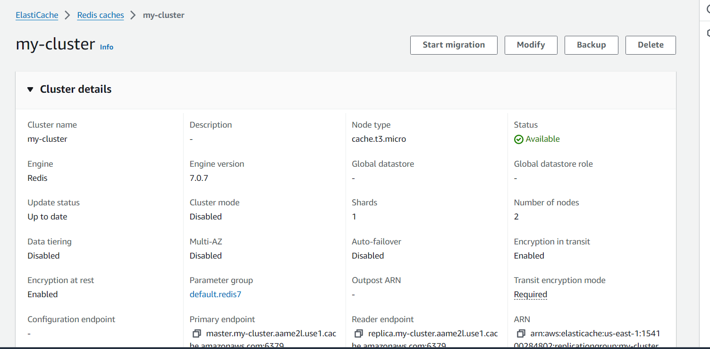
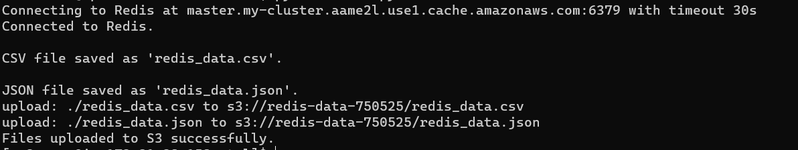
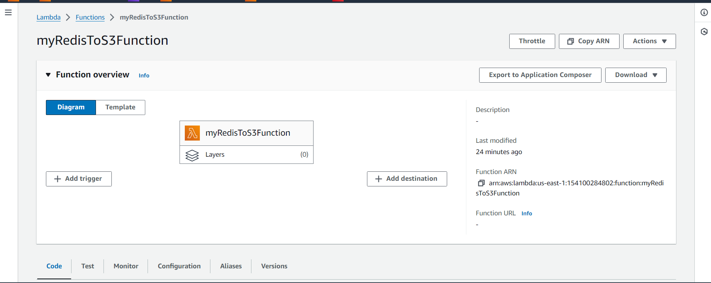
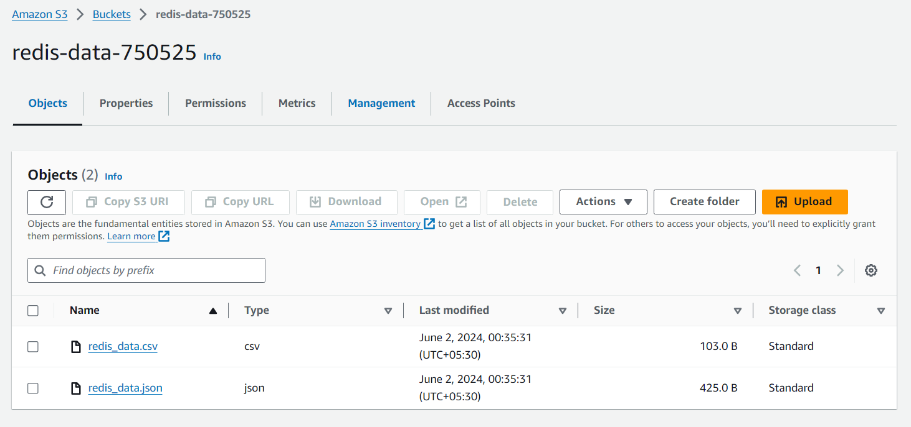

## Created a Redis Cache


## Python Code
```
import redis
import pandas as pd
import json
import os
from dotenv import load_dotenv
import subprocess

# Load environment variables from .env file
load_dotenv()

# Connect to Redis
redis_host = os.getenv('REDIS_HOST')
redis_port = int(os.getenv('REDIS_PORT', 6379))
redis_password = os.getenv('REDIS_PASSWORD', None)
timeout_seconds = 30  # Increased timeout for connection

try:
    print(f"Connecting to Redis at {redis_host}:{redis_port} with timeout {timeout_seconds}s")
    r = redis.StrictRedis(host=redis_host, port=redis_port, decode_responses=True, password=redis_password, ssl=True)

    # Check connection
    if r.ping():
        print("Connected to Redis.")

    # Fetch all keys
    keys = r.keys('*')

    # Fetch data for each key and store in a list
    data = []
    for key in keys:
        key_type = r.type(key)
        if key_type == 'string':
            value = r.get(key)
        elif key_type == 'list':
            value = r.lrange(key, 0, -1)
        elif key_type == 'set':
            value = list(r.smembers(key))
        elif key_type == 'hash':
            value = r.hgetall(key)
        elif key_type == 'zset':
            value = list(r.zrange(key, 0, -1))
        else:
            value = f"Unsupported type: {key_type}"
        data.append({"key": key, "value": value})

    # Convert list to DataFrame
    df = pd.DataFrame(data)

    # Convert DataFrame to CSV
    csv_filename = 'redis_data.csv'
    df.to_csv(csv_filename, index=False)
    print(f"\nCSV file saved as '{csv_filename}'.")

    # Convert DataFrame to JSON
    json_filename = 'redis_data.json'
    with open(json_filename, 'w') as json_file:
        json.dump(data, json_file, indent=4)
    print(f"\nJSON file saved as '{json_filename}'.")

    # Upload files to S3 using AWS CLI with provided credentials
    s3_bucket_name = os.getenv('S3_BUCKET_NAME')
    s3_csv_key = 'redis_data.csv'
    s3_json_key = 'redis_data.json'

    # AWS CLI command to upload files to S3 with provided credentials
    subprocess.run(['aws', 's3', 'cp', csv_filename, f's3://{s3_bucket_name}/{s3_csv_key}', '--region', 'us-east-1', '--profile', 'default'])
    subprocess.run(['aws', 's3', 'cp', json_filename, f's3://{s3_bucket_name}/{s3_json_key}', '--region', 'us-east-1', '--profile', 'default'])
    print("Files uploaded to S3 successfully.")

except Exception as e:
    print(f"Error: {e}")

```

## Output of the code 
we are fetching data in .csv and .json formate


## Created a lamda with this code 


## Now it is working and uplaoding files to the s3
 

