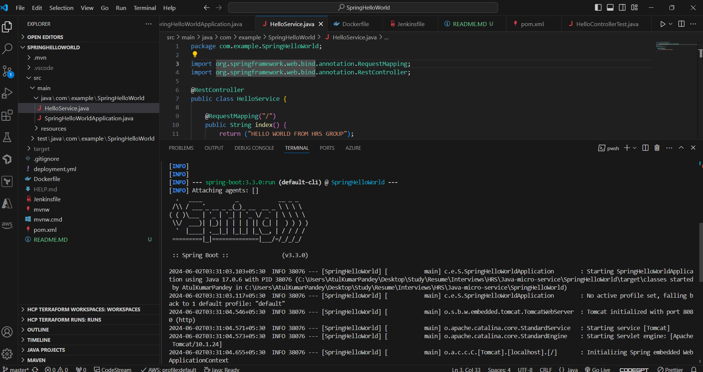
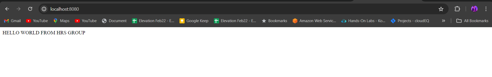
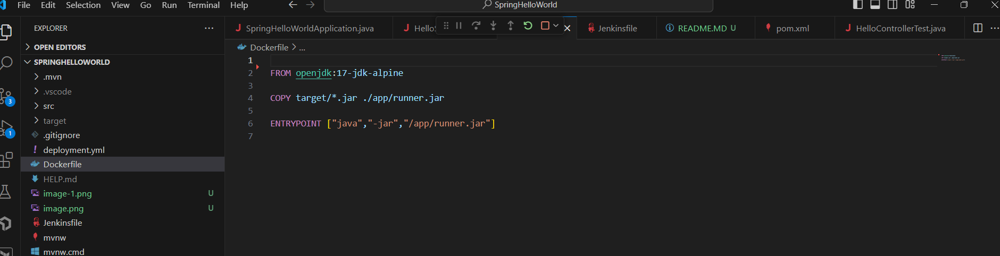
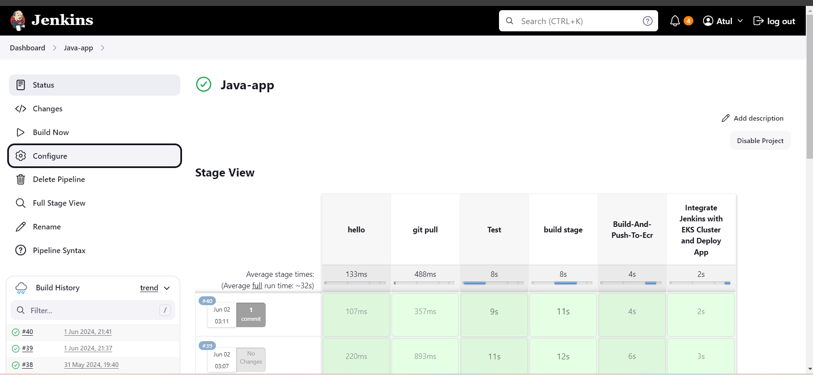
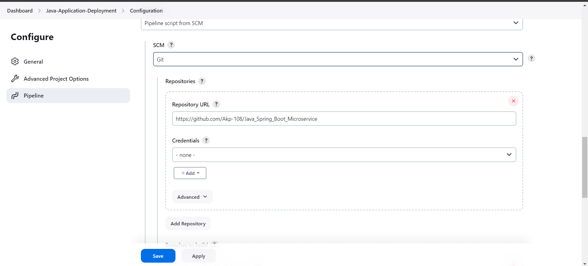
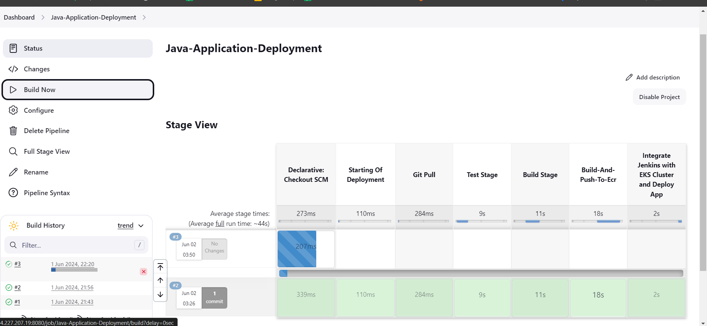
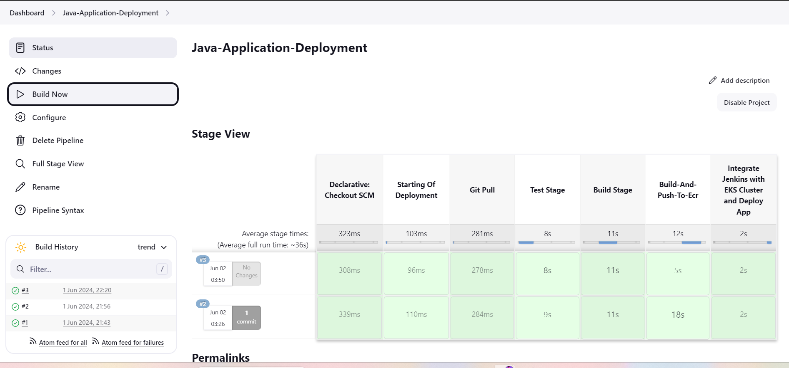
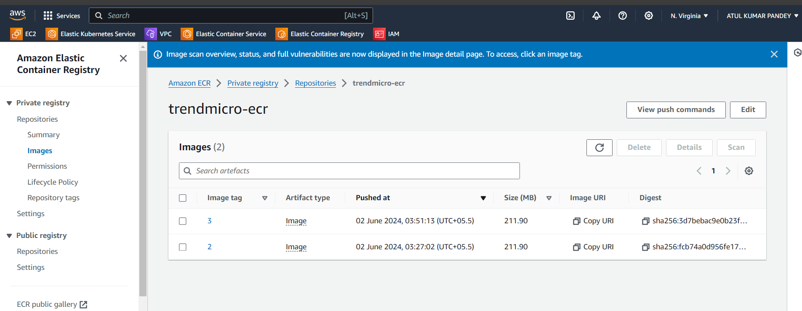
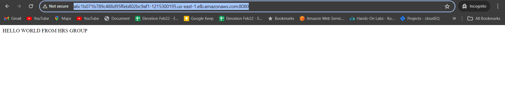

# AUTOMATION

## Spring-Boot Microservce 


microserice is running og localhost:8080


## Docker file for Java 


```

FROM openjdk:17-jdk-alpine

COPY target/*.jar ./app/runner.jar

ENTRYPOINT ["java","-jar","/app/runner.jar"]


```

## Deployment and Service File
```
apiVersion: apps/v1
kind: Deployment
metadata:
  name: javaapp
spec:
  selector:
    matchLabels:
      app: javaapp
  template:
    metadata:
      labels:
        app: javaapp
    spec:
      containers:
      - name: javaapp
        image: 154100284802.dkr.ecr.us-east-1.amazonaws.com/java_jenkins:latest
        ports:
        - containerPort: 8080


---
apiVersion: v1
kind: Service
metadata:
  name: javaapp-svc
spec:
  selector:
    app: javaapp
  type: LoadBalancer
  ports:
  - port: 8080
    targetPort: 8080


```

we are using this docker file for creating docker image of of our java applcaionn and we are deploy it in the EKS cluster

## Setup Jenkis Pipeline



## Jenkins file
 ``` 
 pipeline{
    agent any
    stages{
        stage("Starting Of Deployment"){
            steps{
                echo "Starting of the Deployment of Java Application to EKS cluster"
            }
        }
        
        stage("Git Pull"){
          steps{
               checkout scmGit(branches: [[name: '*/master']], extensions: [], userRemoteConfigs: [[url: 'https://github.com/Akp-108/Java_Spring_Boot_Microservice']])
          }
        }
        
        stage("Test Stage"){
            steps{
                sh 'mvn test'
            }
        }
        
        stage("Build Stage"){
            steps{
                sh "mvn clean package"
            }
        }
        stage("Build-And-Push-To-Ecr"){
            steps{
                withAWS(credentials: 'AWS_CRED', region: 'us-east-1') {
                sh 'aws ecr get-login-password --region us-east-1 | docker login --username AWS --password-stdin 154100284802.dkr.ecr.us-east-1.amazonaws.com'
                sh 'docker build -t trendmicro-ecr .'
                sh "docker tag trendmicro-ecr:latest 154100284802.dkr.ecr.us-east-1.amazonaws.com/trendmicro-ecr:${BUILD_ID}"
                sh "docker push 154100284802.dkr.ecr.us-east-1.amazonaws.com/trendmicro-ecr:${BUILD_ID}"
                }
            }
        }
        
        
        stage('Integrate Jenkins with EKS Cluster and Deploy App') {
            steps {
                withAWS(credentials: 'AWS_CRED', region: 'us-east-1') {
                  script {
                    sh ('aws eks update-kubeconfig --name trendmicro-eks-cluster --region us-east-1')
                    sh  'sed -i "s/java_jenkins:latest/trendmicro-ecr:${BUILD_ID}/g" deployment.yml'
                    sh "kubectl apply -f deployment.yml"
                }
                }
        }
    }
    }
}
```

## Important Plugins
```
1. Amazon EC2
2. Amazon ECR
3. Docker Plugin
4. Kubernetes CLI
5. Pipeline:AWS steps

```

## Pipeline Configuration

Our code is present in the public repo that's why we are not using any authetication. if it will be any private repo then we are can add authetication for pulling the repo.

 
----

## Pipeline Deployment
Now we are saving and building the pipeline





Once Build is completed it will push the image to the AWS ECR.



and then it will deploy this image to the EKS cluster so that and attach a load balancer.


Now our application is running and aplication load balancer is also attach to the application for handing the traffic.

## Access to the application


using that load balancer we are able to access this appliacion on port 8080.

## Now everything is working as expected.


